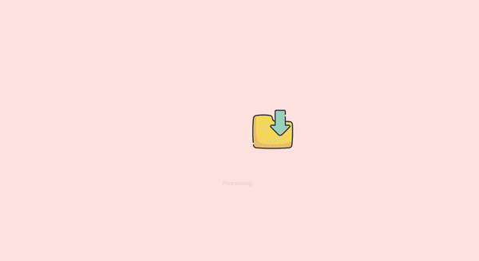

# Processing files
Create a processing files animation. Start with the existing `index.html` and `styles/index.css` files and icons in the `images` folder.

Looks like there are images included in the starting HTML, but if you try to open the website with a browser, the images don't work! Find and fix the issue.

Processing Example:

